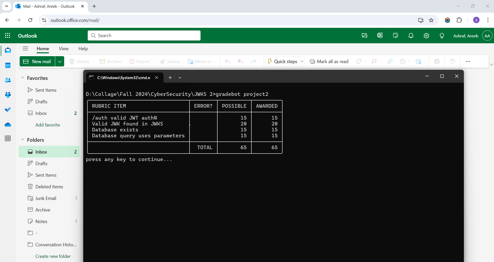

**Areeb Ashraf - aa2672**

- To install dependancies `npm install express jsonwebtoken node-jose sqlite3` (make sure you have node and npm installed already)
- To run program `node server.js`

- Check the JWKS Endpoint
`curl http://localhost:8080/.well-known/jwks.json`

- Generate a valid JWT:
`curl -X POST http://localhost:8080/auth`

- Generate an expired JWT:
`curl -X POST http://localhost:8080/auth?expired=true`

- To run gradebot `cd` into the root folder and run `gradebot project2`

**Gradebot Screenshot**
